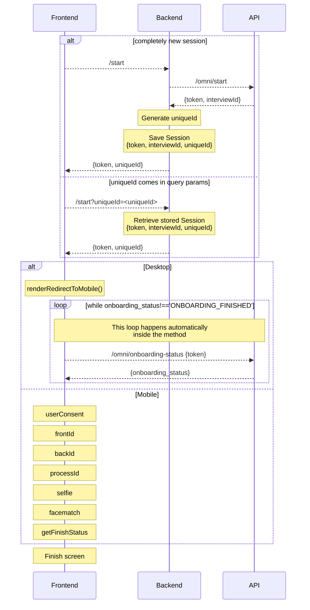

# Onboarding Extended Vanilla Javascript Example
This examples runs the basic create session -> renderRedirectToMobile -> userConsent -> frontId -> backID ->
processId -> Selfie -> faceMatch -> getFinishStatus flow, the code is simple enough to insert or remove any
step for testing or creating proof of concepts.

The code is made with renderRedirectToMobile as first step, if it detects that the user is in desktop it will
present renderRedirectToMobile with an `URL` that points to this same file using the `VITE_LOCAL_SERVER_URL`
enviroment variable + a generated `uniqueId` that we received from the call to `/start`.

The `renderRedirectToMobile` has a behaviour where it automatically polls for the status of the session, and
when it detects that the session has finished, it executes the `onSuccess` method to continue.

The URL when opened in mobile will read the `uniqueId` from the query params, and send it to `/start` to continue
the session instead of creating a new one.

The `uniqueId` links both desktop and mobile that are running in parallel to give the best possible experience to
the user.

This diagram explains it in detail:



# Requirements
Vite requires Node.js version 14.18+, 16+. some templates require a higher Node.js version to work, please upgrade if your package manager warns about it.

# Install
Run `npm install`
# Config
Copy `.env.example` to `.env.local` and add your local values
```
VITE_TOKEN_SERVER_URL=/api
VITE_LOCAL_SERVER_URL=https://your-ip:port/
VITE_API_URL=https://demo-api.incodesmile.com/0
VITE_SDK_URL=https://sdk.incode.com/sdk/onBoarding-1.70.0.js
```
Remember the Flow holds the backend counter part of the process, some configurations there might affect the behavior of the WebSDK here.

# Backend Server
A backend server that will generate the url is needed for this sample,
luckily for you we already have sample server NodeJS, please reffer to our documentation on subject:
[Backend Sample Server](https://developer.incode.com/docs/code-samples-for-web-integrations#backend-sample-server)

In order to simplfy development, this repo is configured to reverse
proxy a local backend server (`http://localhost:3000`) in the `/api`
url like `https://<your-ip>:5173/api`, if you want to point your
frontend development to a backend server deployed elsewhere, change
the VITE_TOKEN_SERVER_URL to the full url of such server.

# Run
Vite is configured to serve the project using https and and expose him self, so you can easily test with your mobile phone on the local network.

run `npm run dev`

A new server will be exposed, the data will be in the terminal

# Build
run `npm run build`

A new build will be created in `/dist` you can serve that build everywhere just remember to serve with https.

# Testing especific versions locally
You can save the specific version needed under `/public` and change the `VITE_SDK_URL` variable on `.env.local` to something like:

```
VITE_SDK_URL=/name-of-the-js-file.js
```

# Author

© Incode Technologies Inc. All rights reserved.
